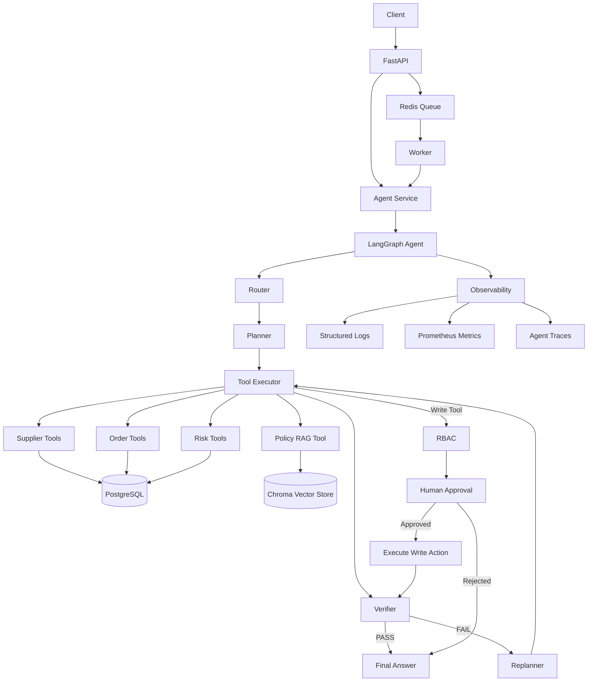

# EnterpriseOps Agent

A production-oriented AI Agent for enterprise procurement and supply-chain risk operations.

The project demonstrates how a simple LLM function-calling agent can evolve into a stateful, controllable and observable enterprise agent system using LangGraph, RAG, RBAC, Human-in-the-loop, asynchronous execution and containerized deployment.

---

## Overview

EnterpriseOps Agent is designed for procurement and supply-chain risk scenarios.

The agent can:

- Query supplier information
- Search purchase orders
- Identify high-risk orders
- Retrieve operational risk events
- Search enterprise procurement and supplier policies
- Combine structured business data with unstructured policy knowledge
- Generate multi-step execution plans
- Verify tool execution results
- Replan when evidence is insufficient
- Enforce role-based tool permissions
- Pause write operations for human approval
- Resume interrupted workflows
- Run synchronous or asynchronous agent tasks
- Record execution traces and metrics

The project uses synthetic enterprise data and policies for demonstration purposes.

## Model Provider

The agent uses Alibaba Cloud Model Studio (Bailian) through its OpenAI-compatible
API. Chat, function calling and RAG embeddings share the same API credential.

Configure these values in `.env`:

```bash
DASHSCOPE_API_KEY=your-bailian-api-key
DASHSCOPE_BASE_URL=https://dashscope.aliyuncs.com/compatible-mode/v1
DASHSCOPE_CHAT_MODEL=qwen-plus
DASHSCOPE_EMBEDDING_MODEL=text-embedding-v4
DASHSCOPE_EMBEDDING_DIMENSIONS=1024
VECTOR_COLLECTION_NAME=enterprise_policy_bailian_v4
```

For a dedicated Bailian workspace, replace `DASHSCOPE_BASE_URL` with the
workspace-specific compatible endpoint shown in the Bailian console. After
changing the embedding model or collection name, rebuild the knowledge base:

```bash
docker compose run --rm api python -m scripts.build_knowledge_base
```

---

## Motivation

A basic LLM agent can call tools, but complex enterprise tasks require more than function calling.

Several engineering problems appear quickly:

1. Complex tasks may require multiple dependent tool calls.
2. LLM decisions need to be observable and controllable.
3. Enterprise policies are private and cannot be assumed by the model.
4. Write operations require permission and human approval.
5. Agent workflows need failure recovery.
6. Production systems require logging, metrics, evaluation and deployment support.

This project addresses these problems incrementally.

---

## Architecture Evolution

### V1 — Function Calling Baseline

User
→ LLM
→ Function Calling
→ Business Tool
→ Answer

The baseline agent validates whether direct tool calling is sufficient for enterprise queries.

### V2 — LangGraph Workflow Agent

User
→ Router
→ Planner
→ Tool Executor
→ Verifier
→ Replanner
→ Final Answer

The workflow explicitly models agent execution using State, Nodes and Conditional Edges.

### V3 — Enterprise Knowledge

Structured Business Data
+
Enterprise Policy RAG
→ Risk Analysis

Enterprise policies are retrieved from a vector knowledge base instead of relying on model memory.

### V4 — Security and Human Approval

Tool Call
→ RBAC
→ Human Approval
→ Execute

State-changing actions cannot be performed automatically.

### V5 — Production Runtime

FastAPI
→ Agent Service
→ LangGraph
→ PostgreSQL / Chroma
→ Redis Worker
→ Metrics / Logging
→ Docker

---

## System Architecture



---

## Evaluation

All evaluation labels live in one synthetic benchmark file:
`evaluation/dataset.json`. The benchmark contains 110 unique cases:

- 60 common cases executed by both Baseline and Workflow for a fair comparison
- 30 Workflow extension cases covering multi-tool, RBAC and approval behavior
- 20 policy retrieval cases with expected source documents

Rebuild the unified dataset after editing its generator:

```bash
python -m evaluation.build_synthetic_datasets
```

Run the complete benchmark with one command:

```bash
python -m scripts.run_evaluation
```

The command prints all metrics to the terminal and writes the consolidated
report to `outputs/evaluation/summary.json`. Detailed results are grouped under
the same output directory. Metrics include strict task completion, routing,
exact tool sequence, argument matching, tool precision/recall/F1,
security-control accuracy, RAG Hit@K/MRR/Recall@K, latency percentiles and model
usage. Synthetic labels are expected results; all reported scores come from
actual evaluator runs.
